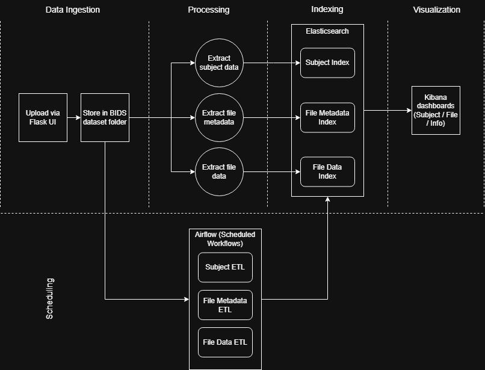

# **BIDS-ETL: An Integrated Framework for Scalable Management and Monitoring of Multimodal Neuroimaging Data**

## **Overview**

Modern neuroimaging studies generate massive and increasingly multimodal datasets—ranging from structural and functional MRI to DWI and EEG. While the **BIDS** standard addresses the long-standing issue of format inconsistency in neuroimaging research, large-scale repositories such as biobanks still lack unified infrastructures for **efficient ingestion, indexing, search, metadata processing, automated updating, and visual monitoring** of their evolving datasets.

This project proposes an end-to-end, modular framework that integrates the strengths of BIDS, PyBIDS, Elasticsearch, Kibana, Apache Airflow, and containerized deployment.
The result is a robust ETL pipeline that enables:

* **Efficient storage and search** across heterogeneous neuroimaging modalities
* **Metadata-driven indexing** for fast and scalable retrieval
* **Dynamic dashboards** for exploratory analysis
* **Automated ingestion and update workflows**
* **A lightweight web interface** for adding new subjects
* **Consistent deployment using Docker**

The system demonstrates how large-scale multimodal neuroimaging data can be managed in a real operational environment such as biobanks, research labs, or clinical repositories.

---

## **System Components Implemented**

### **1. Data & Metadata Extraction and Processing**

A comprehensive Python pipeline processes raw BIDS-structured datasets.
Using **PyBIDS**, **JSON/TSV parsing**, and custom scripts:

* Subjects, sessions, tasks, and modality-specific metadata (fMRI, EEG, DWI, etc.) are extracted.
* File-level details such as acquisition parameters, sizes, and modality tags are parsed.
* Data are transformed into standardized JSON documents compatible with Elasticsearch.

This step forms the semantic backbone that enables fast, attribute-based search.

---

### **2. Indexing and Storage in Elasticsearch**

The processed documents are indexed into separate Elasticsearch indices:

* **subjects index** – demographic and subject-level information
* **files index** – file-level metadata, modalities, paths
* **experiments index** – task/session information

A custom mapping was designed to support numeric, keyword, and date-based filtering.
This structure enables **sub-second queries** even on growing datasets and supports full-text, multi-attribute, and aggregated search.

---

### **3. Monitoring and Visualization with Kibana**

Elasticsearch indices are visualized through a set of **interactive Kibana dashboards**:

* Distribution of modalities (fMRI, EEG, DWI, …)
* Subject demographics
* File-specific metadata summaries
* Drill-down exploration for sessions, tasks, and acquisitions

These dashboards dynamically reflect system updates, enabling real-time quality control and exploratory data analysis.

---

### **4. Web Interface for Adding New Data**

A minimal but functional **Flask-based web UI** enables authorized users to upload new BIDS-compatible data bundles:

* ZIP packages are uploaded through the form
* Files are validated and unpacked
* Metadata are extracted automatically
* New records propagate through the indexing pipeline

This allows the dataset to grow continuously without requiring manual intervention.

---

### **5. Automated Updating with Apache Airflow**

To ensure consistency with real biobank workflows where data grows continuously, the system integrates an **Airflow DAG** that handles:

* Scheduled ingestion of new ZIP packages
* Automated extraction and indexing
* Rebuilding dashboards when needed
* Logging and fault monitoring

This results in a **fully automated ETL loop** where the system stays up-to-date as new data arrives.

---

### **6. Docker-based Modular Integration**

All modules—Flask service, extraction pipeline, Elasticsearch, Kibana, and Airflow—are packaged through **Docker**:

* Ensures reproducible environments
* Simplifies deployment on any server
* Enables isolated development
* Supports scaling in real-world usage scenarios

This architecture ensures reliability, portability, and consistent performance across machines.

---

## **System Architecture**

Below is the high-level architecture of the proposed framework:

---

## **Results**

### **Performance of the Proposed Search Engine vs. PyBIDS**

The evaluation was conducted using the **OpenNeuro ds006040** dataset (fMRI, DWI, EEG; 28 subjects).
Three scenarios were tested: dynamic data addition, search performance, and periodic updates.

The search speed comparison:

| Method            | Records Found | Execution Time (s) | Notes                                         |
| ----------------- | ------------- | ------------------ | --------------------------------------------- |
| **Elasticsearch** | 28            | **0.008**          | ~830× faster                                  |
| **PyBIDS**        | 28            | 6.651              | Same correctness, slower due to file crawling |

These results highlight the practical value of full-text indexing when working with large neuroimaging datasets.

---

### **Additional Evaluation Findings**

* The system successfully **reflected newly added data across all dashboards and indices**.
* Airflow’s automated runs executed stably across multiple cycles.
* The architecture demonstrated strong potential for **scalability**, supporting future expansion to larger datasets and additional modalities.
* The pipeline can be extended with machine learning models for automated QC or metadata inference.

---

## **Conclusion**

This project introduces a unified, scalable, and extensible architecture for managing multimodal neuroimaging data using the BIDS standard.
By combining open-source tools—including PyBIDS, Elasticsearch, Kibana, Airflow, and Docker—it provides:

* A consistent mechanism for structuring and indexing complex neuroimaging datasets
* Rapid search and retrieval even at large scales
* Real-time monitoring and analytics
* Automated incremental updates
* A clean interface for dataset growth

The proposed approach addresses key limitations of existing workflows and represents a practical foundation for large research infrastructures, clinical repositories, and biobank-scale neuroimaging platforms.

